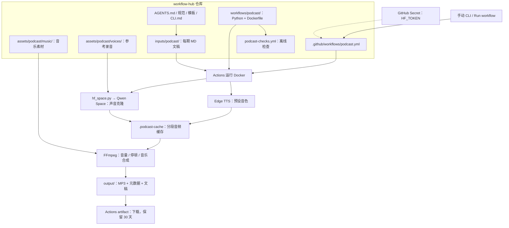

# Workflow Hub 仓库架构

每条业务工作流放在 workflows/<名称>/，对应输入放在 inputs/<名称>/。当前实现播客工作流，后续业务可新增独立目录及 Actions 入口。

上传 MD 不自动配音；修改程序触发离线 CI。podcast-voices.yml 单独用于 Edge 音色目录及试听。podcast.yml 同时支持 workflow_dispatch 和 workflow_call；后者须由调用方显式传递 HF_TOKEN。

HF_TOKEN 是 GitHub 设置中的凭证，不是仓库文件。模型在微软或 HF 的服务器运行，仓库仅保存调用代码与声音配置，不保存模型权重。

参考录音默认忽略提交。只有明确同意公开时才上传到这个公开仓库；也可本地挂载使用。缺少 Secret 或录音时不会声称克隆成功。适配器暂时固定 Qwen 官方 Space，CosyVoice/F5 可后续增加独立适配器。

缓存由 Actions cache 保留，生成物由 artifact 保存，不自动写回仓库。图中 output/、缓存属于运行目录，默认不纳入 Git。GitHub Pages 目前未接入；未来可作为成品播放器，不能运行语音模型后端。

接入步骤见 [HF_SPACE.md](workflows/podcast/HF_SPACE.md)，运行及下载见 [CLI.md](workflows/podcast/CLI.md)。
