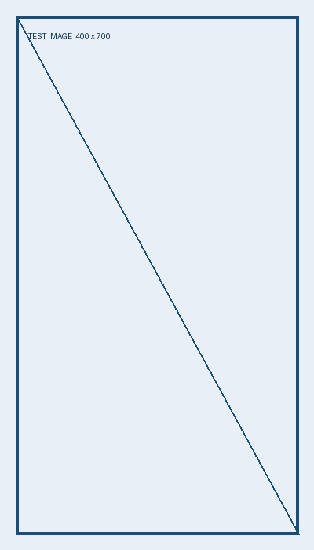
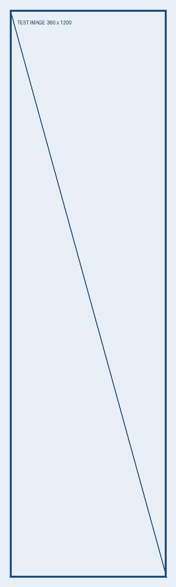

# 公众号排版验收文章

这是一篇功能验收样稿，包含 **粗体强调**、*斜体* 和普通段落。三种版式应该保留相同内容和图片顺序。

## 一、横图与段落


> 预览用于检查阅读效果，微信实际保存的内容需通过草稿取回校验。

### 列表测试

1. 在 GitHub 准备文章。
2. 运行内容导入。
3. 在工作台编辑并保存新版本。

- 切换历史版本。
- 选择简洁、商务或科技版式。
- 检查图片是否在原位置。

## 二、竖图与表格



| 模块 | 验收目标 |
|---|---|
| 版本 | 保存后产生新版本 |
| 图片 | 位置与 Markdown 一致 |
| 权限 | 上传 Token 不能发布 |

## 三、长图与代码



```python
article = {"title": "示例", "version": 1}
print(article)
```

[项目仓库](https://github.com/mattxiaoxuesheng/workflow-hub)
