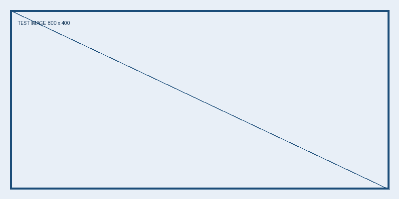

# 微信公众号自动化流水线测试

这是一篇用于验证 GitHub → GitHub Actions → 腾讯云 Publisher → 微信公众号工作台的测试文章。**不用于正式对外发布。**

## 本次测试检查什么

这次测试重点检查 Markdown 是否能被正确校验、打包为内容包、保存为 GitHub Artifact，并通过已配置的上传 Token 导入腾讯云 Publisher。

> 如果你在腾讯云 Publisher 的文章列表中看到本文，说明 GitHub 到腾讯云的上传链路已经打通。

## 预期结果

| 环节 | 预期结果 |
|---|---|
| GitHub | 测试文章保存在 `inputs/wechat/pipeline-test-20260910/` |
| Actions | Markdown 与图片校验通过并生成 ZIP 内容包 |
| Artifact | 保存 `article-package.zip`，可用于排查和复现 |
| 腾讯云 | Publisher 返回导入成功的版本号 |
| 微信公众号 | 在 Publisher 中人工点击“发送微信草稿”后进行真实接口验收 |

## 测试说明

当前系统把“导入文章”和“正式发送微信公众号”分开：GitHub Actions 只负责把内容安全地送到腾讯云 Publisher；发送草稿和正式发布需要在 Publisher 工作台中确认，避免自动化误发。

如果本文的标题、段落、粗体、引用、表格和图片都能在预览中正常显示，则说明基础内容格式也通过了这次验收。
